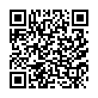

# 概要

「Maven3のはじめかた」はMaven{{book.version.maven}}に対応したMavenの入門ならびに応用を助ける日本語資料（開発中）です。
GitHubにて[電子書籍（PDF, ePUB, MOBI）を無償配布しています](https://github.com/KengoTODA/what-is-maven/releases)。
こちらのQRコードからも無償配布ページに行けます。

ライセンスならびに著作権については[はじめに](./preface/README.md)をご覧ください。
英語の資料をお探しの方は、やや古い情報が混ざりますが[Sonatype社の資料](http://www.sonatype.com/resources/books)をお薦めします。
