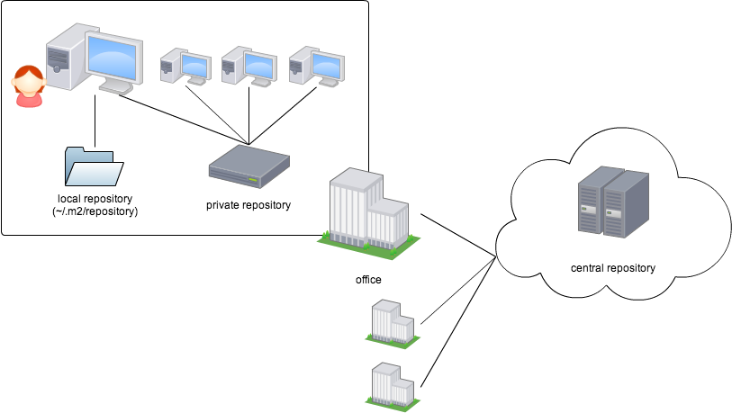

# Maven入門

この章では、Mavenに初めて触れるJava開発者のためにインストールから使い方までを説明します。

## Mavenのインストール

まず先に[JDKをインストール](http://www.oracle.com/technetwork/java/javase/downloads/)しておいてください。

次に[Maven公式サイトから圧縮ファイルをダウンロード](http://maven.apache.org/download.cgi)し、展開してください。
binディレクトリに実行可能ファイルが含まれていますので、これをPATHに追加すればインストールは完了です。

最後に`mvn --version`を実行して、Mavenが正しく実行されること・意図通りのJDKが認識されていることを確認してください。
参考までに、執筆している環境では以下のような出力が得られました。

```zsh
$ mvn --version
Apache Maven 3.1.0 (893ca28a1da9d5f51ac03827af98bb730128f9f2; 2013-06-28 10:15:32+0800)
Maven home: /usr/local/Cellar/maven/3.1.0/libexec
Java version: 1.7.0_25, vendor: Oracle Corporation
Java home: /Library/Java/JavaVirtualMachines/jdk1.7.0_25.jdk/Contents/Home/jre
Default locale: en_US, platform encoding: US-ASCII
OS name: "mac os x", version: "10.8.4", arch: "x86_64", family: "mac"
```

このように、Mavenは`mvn`コマンドによって呼び出します。`--version`はMavenやJDKのバージョンを出力するための
オプションです。オプションについては適宜解説していきます。

利用されるJDKが意図したものではなかった場合、`JAVA_HOME`環境変数にJDKのホーム（jreディレクトリの親ディレクトリ）を
設定してから再度`mvn --version`を実行して確認してください。

## Mavenの使い方

基本的には`mvn package`のように行いたいことを引数に渡して実行するだけです。
この「行いたいこと」をMavenではフェーズ（phase）と呼んでいます。主なphaseをいくつか紹介します。

* validate （プロジェクトの状態確認）
* clean （一時ファイルの削除）
* compile （プロジェクトのコンパイル）
* test-compile （テストコードのコンパイル）
* test （単体テストの実行）
* package （アーティファクトの作成）
* integration-test （インテグレーションテストの実行）
* verify （アーティファクトの検証）
* install （アーティファクトをローカルリポジトリに配置）
* deploy （アーティファクトをリモートリポジトリに配置）

アーティファクト（artifact）とはjarやwarのような[成果物のこと][1]を指します。またリポジトリとは他の
開発者とアーティファクトを共有するための保管庫を指します。詳しくはのちほど説明します。

ここでは例として、筆者が開発している[findbugs plugin](https://github.com/eller86/findbugs-plugin)プロジェクトを
ビルドしてみましょう。以下のコマンドを実行してください。`target`ディレクトリが作成され、中にjarファイルが入っていることが
確認できますか？

```zsh
$ git clone https://github.com/eller86/findbugs-plugin.git
$ cd findbugs-plugin
$ mvn package
$ ls ./target
```

targetディレクトリにはアーティファクトだけでなくプロジェクトのclassファイルやテストケースのclassファイル、
単体テストの実行結果も配置されていることがわかると思います。コマンドの引数にはpackage（アーティファクトの作成）
しか指定していないのに、Mavenがpackageに必要なcompileやtest-compile、testフェーズも実行してくれていた
ということです。

さて、もうひとつ便利なフェーズを試してみましょう。`mvn clean`を実行すると、`target`ディレクトリに作成された
一時ファイルをディレクトリごと削除します。実行後にディレクトリが削除されていることを確認してください。

```zsh
$ ls -l
$ mvn clean
$ ls -l
```

Mavenはビルドを高速化するため、既に作成されたclassファイルなどを再利用することがあります。
ビルドを完全にまっさらな状態から実行する場合は、事前にcleanを実行しておきましょう。

なお`target`ディレクトリの削除によってcleanの実行を代替できるように見えますが、一時ファイルが
targetディレクトリ以外の場所に作られることもありえますので、ディレクトリの削除ではなくcleanを
利用するように心がけましょう。

### Antに慣れている方のための補足

Antでは各targetの間に依存関係を明示することができました。例えば以下のXMLは、packageを実行する前に
compileを実行しなければならないことを意味しています。

```xml
  <target name="compile">
    ...
  </target>

  <target name="package" depends="compile">
    ...
  </target>
```

Mavenではこうしたtargetと依存関係、各targetで実行すべきtaskがデフォルトで用意されていると考えてください。
開発者が行うべきことがJavaプロジェクトのビルドである以上、行うべき作業には他のJavaプロジェクトとの共通点が
多いはずです。Mavenはそれをデフォルトで提供することにより、開発者がファイルに書くべき設定を削減しています。

MavenではAntのtargetがフェーズ、Antのtaskがプラグインに相当します。各フェーズで実行されるプラグインは
デフォルトで割り当てられたものに加え、好みのものを追加することも可能です。

### makeやnpmに慣れている方のための補足

Mavenのインストールは`make install`や`npm install -g`とは違い、プロジェクトから実行可能ファイルを作って
PATHに追加することを意味しません。アーティファクトを作ってプライベートリポジトリに配置することです。

またデフォルトではビルドされたアーティファクトは`java -jar`で実行できません。マニフェストファイルを適切に作成する必要があります。

## ビルド・ライフサイクルについて

さて、Mavenはどのようにしてpackageにcompileやtestが必要だと判断したのでしょうか。これを知るには
[ビルド・ライフサイクル][2]について知る必要があります。

ビルド・ライフサイクルとは「コンパイル→テスト→JAR作成」などのビルドにおける作業の順番を定義したものです。
標準でdefaultサイクルとcleanサイクル、siteサイクルが用意されています。先ほどpackageフェーズ実行時に
使ったのがdefaultサイクル、cleanフェーズ実行時に使ったのがcleanサイクルです。

それぞれのビルド・ライフサイクルは1つ以上のフェーズを含んでいます。例えばdefaultライフサイクルには
compile, test, verify, installといったフェーズが含まれています。

これらのフェーズは順番に並んでいて、あるフェーズが実行されるには *それ以前のフェーズが実行済み* でなければ
なりません。つまり、すべてのフェーズはそのひとつ前のフェーズに依存しています。

例えばdefaultライフサイクルには以下のように並んだフェーズが含まれています。

1. validate
2. initialize
3. generate-sources
4. process-sources
5. generate-resources
6. process-resources
7. compile
8. process-classes
9. generate-test-sources
10. process-test-sources
11. generate-test-resources
12. process-test-resources
13. test-compile
14. process-test-classes
15. test
16. prepare-package
17. package
18. pre-integration-test
19. integration-test
20. post-integration-test
21. verify
22. install
23. deploy

先ほどMavenがコンパイルや自動テストを実行したのは、packageフェーズを実行するために必要な
validateからprepare-packageまでの16のフェーズすべてを実行したためです。
こうしたフェーズの依存関係によって、Mavenユーザはやりたいことだけを伝えるだけで済むのです。

さて、このdefaultライフサイクルにはcleanが見当たりません。cleanフェーズはcleanライフサイクルと呼ばれる他の
ライフサイクルに属しています。このライフサイクルには3つのフェーズがあります。

1. pre-clean
2. clean
3. post-clean

例えば `mvn clean install` と実行すると、まずはcleanライフサイクルが実行され、その次にdefaultライフサイクルが
実行されます。`mvn clean clean`ではcleanライフサイクルが2回実行されます。
「コンパイルしてからテストしたい！」という場合でも`mvn compile test`ではなく`mvn test`で充分だという
ことに注意してください。

## フェーズとプラグイン

それぞれのフェーズでは、登録されたプラグインが

cleanフェーズはデフォルトで
[maven-clean-plugin](http://maven.apache.org/plugins/maven-clean-plugin/)を実行します。


## pom.xmlについて

プロジェクトのトップディレクトリには通常`pom.xml`という名前の設定ファイルを配置します。このファイルにはプロジェクトの情報、依存関係、利用するプラグイン、ライセンス、SCMのURLなど様々な情報を記録できます。


## リポジトリとは

JARなどの成果物やJavadocをライブラリを整理してまとめておく場所のことです。セントラルリポジトリ、ローカルリポジトリ、プライベートリポジトリの3種類があります。



## セントラルリポジトリとは

インターネットに公開されているリポジトリで、たくさんのライブラリが公開されています。

- [Maven central repository](http://search.maven.org/)

## プライベートリポジトリとは

何らかの理由でセントラルリポジトリにライブラリを公開したくない場合、自分でリポジトリを用意して利用することができます。このリポジトリのことをプライベートリポジトリと呼びます。WEBDAVが使えるサーバならなんでもプライベートリポジトリとして使えますが、Apache Archivaや[Nexus](http://www.sonatype.org/nexus/)などの管理機能を持つウェブアプリケーションを使うと便利です。

なおプライベートリポジトリ以外のリポジトリを表す用語としてリモートリポジトリ（remote repository）があります。

### プライベートリポジトリを使うには

プライベートリポジトリをセットアップしたら、[pom.xmlに使用するプライベートリポジトリのURLを明記する](http://maven.apache.org/guides/mini/guide-multiple-repositories.html)必要があります。

```xml
<repository>
  <id>my-repo1</id>
  <name>your custom repo</name>
  <url>http://jarsm2.dyndns.dk</url>
</repository>
```

## ローカルリポジトリとは

mvnコマンドを実行したマシンにあるディレクトリのことです。デフォルトでは`~/.m2/repository`が利用されます。他のリポジトリからダウンロードしたライブラリを保管したり、`install`ゴールでJARをインストールしたりするために使われます。

基本的にMavenは、ライブラリを取得ときにまずローカルリポジトリを確認し、そこになかった場合にセントラルリポジトリやプライベートリポジトリを見に行きます。
セントラルリポジトリにもプライベートリポジトリにも公開されていないライブラリを使う場合には、まず `mvn install` でそのライブラリをプライベートリポジトリにインストールしてやるときちんと使うことができます。

## 依存関係とは

プロジェクトをビルドするときに、JDKだけでなくライブラリを必要とすることがあります。このことを「プロジェクトはライブラリに[依存している](http://maven.apache.org/guides/introduction/introduction-to-dependency-mechanism.html)」と表現します。
Mavenではプロジェクトがライブラリに依存していることを以下のように明記できます。

```xml
<dependency><!-- このプロジェクトはJUnit バージョン4.11に依存している -->
  <groupId>junit</groupId>
  <artifactId>junit</artifactId>
  <version>4.11</version>
  <scope>test</scope>
</dependency>
```

## ライブラリの指定方法

依存するライブラリを指定する場合、ライブラリを特定するために *groupId*, *artifactId*, *version*の3つを指定する必要があります。これらはそれぞれライブラリが所属するグループ（パッケージ名のようにドメインを逆にしたものを使っている場合が多い）、ライブラリ名、バージョンを意味します。

    ※まれに classifier を指定することもあります。

なお`1.0.0-SNAPSHOT`のように`-SNAPSHOT`で終わるバージョンは開発中を意味しています。開発中のバージョンは実装が変更される可能性があります。
対して`0.9.9`のように`-SNAPSHOT`がつかないバージョンは、実装が変更されることは基本的にありません。

バージョンの書式には`-SNAPSHOT`以外の決まりはありません。バージョンのつけ方に迷う場合は、[Semantic Versioning](http://semver.org/)を参考にすると良いでしょう。

## スコープの意味と使い分け

依存関係を明記する場合、スコープ（scope）を記述するときがあります。スコープとは「いつこのライブラリが必要になるか」を意味するものです。使える条件を明示するという意味で、Javaのスコープ（privateやpublicなど）に似ています。

スコープにはいくつか種類があります。
*compile* はプロジェクトをコンパイルするときと実行するときに必要なライブラリに使います。スコープのデフォルト値がこのcompileなので、`<scope>compile</scope>`は省略できます。
*test* はコンパイルにも実行にも必要ないがテストを実行する際に必要となるライブラリに使います。JUnitやMockito、Powermockなどに使うことが多いでしょう。
*provided* はコンパイル時には必要ないが、実行時には必要なライブラリに使います。ウェブアプリケーションを作成する際は、サーブレットコンテナが提供するライブラリのためにこのスコープを使うことになるでしょう。


  [1]: http://stackoverflow.com/questions/2487485/what-is-maven-artifact "What is Maven artifact?"
  [2]: http://maven.apache.org/guides/introduction/introduction-to-the-lifecycle.html "Introduction to the Build Lifecycle"