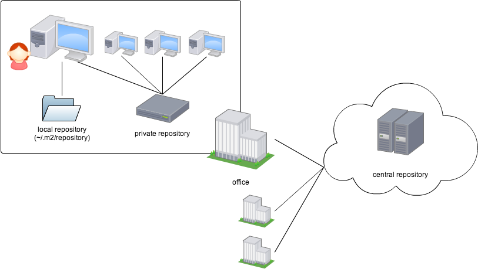

# Mavenリポジトリ

JARなどの成果物やJavadocをライブラリを整理してまとめておく場所のことを、Mavenリポジトリと呼びます。
パブリックリポジトリ、ローカルリポジトリ、プライベートリポジトリの3種類があります。




## パブリックリポジトリ

パブリックリポジトリ（public repository）とは、誰でもインターネット経由でアクセス可能なリポジトリのことです。
Mavenを使う際は、セントラルリポジトリを主に使うことになります。

### セントラルリポジトリとは

Mavenがデフォルトで利用するリポジトリです。たくさんのライブラリが公開されています。

- [Maven central repository](http://search.maven.org/)

## プライベートリポジトリとは

何らかの理由でセントラルリポジトリにライブラリを公開したくない場合、自分でリポジトリを用意して利用できます。このリポジトリのことをプライベートリポジトリと呼びます。WebDAVが使えるサーバならなんでもプライベートリポジトリとして使えますが、Apache Archivaや[Nexus](http://www.sonatype.org/nexus/)などの管理機能をもつウェブアプリケーションを使うと便利です。

### プライベートリポジトリを使うには

プライベートリポジトリをセットアップしたら、[pom.xmlに使用するプライベートリポジトリのURLを明記する](http://maven.apache.org/guides/mini/guide-multiple-repositories.html)必要があります。

```xml
<repository>
  <id>my-repo1</id>
  <name>your custom repo</name>
  <url>http://jarsm2.dyndns.dk</url>
</repository>
```

## リモートリポジトリとは

リモートリポジトリ（remote repository）とは、パブリックリポジトリとプライベートリポジトリを合わせた呼称です。
次に説明するローカルリポジトリの対義語といえます。

## ローカルリポジトリとは

mvnコマンドを実行したマシンにあるディレクトリのことです。デフォルトでは`~/.m2/repository`が利用されます。他のリポジトリからダウンロードしたライブラリを保管したり、`install`ゴールでJARをインストールしたりするために使われます。

基本的にMavenは、ライブラリを取得するときにまずローカルリポジトリを確認し、そこになかった場合にのみリモートリポジトリを見に行きます。
リモートリポジトリにも公開されていないライブラリを使う場合には、まず `mvn install` でそのライブラリをプライベートリポジトリにインストールしてやるときちんと使うことができます。
