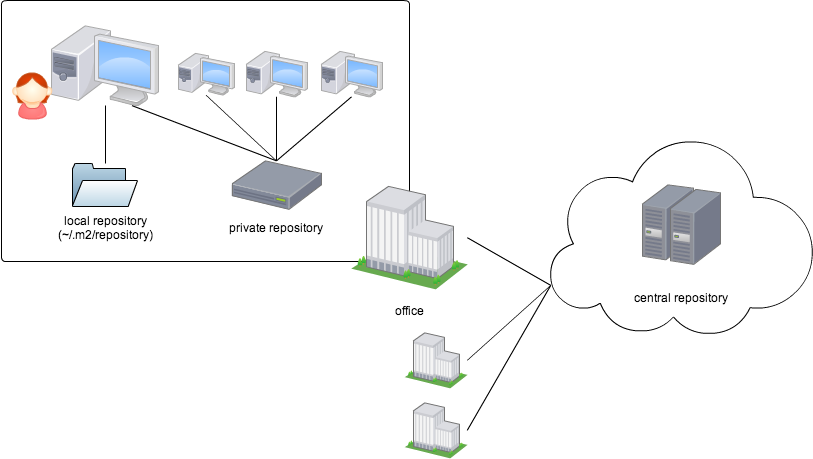

# Mavenリポジトリ

JARなどの成果物やJavadocをライブラリを整理してまとめておく場所のことを、Mavenリポジトリと呼びます。
セントラルリポジトリ、ローカルリポジトリ、プライベートリポジトリの3種類があります。



## セントラルリポジトリとは

インターネットに公開されているリポジトリで、たくさんのライブラリが公開されています。

- [Maven central repository](http://search.maven.org/)

## プライベートリポジトリとは

何らかの理由でセントラルリポジトリにライブラリを公開したくない場合、自分でリポジトリを用意して利用することができます。このリポジトリのことをプライベートリポジトリと呼びます。WEBDAVが使えるサーバならなんでもプライベートリポジトリとして使えますが、Apache Archivaや[Nexus](http://www.sonatype.org/nexus/)などの管理機能を持つウェブアプリケーションを使うと便利です。

なおプライベートリポジトリ以外のリポジトリを表す用語としてリモートリポジトリ（remote repository）があります。

## プライベートリポジトリを使うには

プライベートリポジトリをセットアップしたら、[pom.xmlに使用するプライベートリポジトリのURLを明記する](http://maven.apache.org/guides/mini/guide-multiple-repositories.html)必要があります。

```xml
<repository>
  <id>my-repo1</id>
  <name>your custom repo</name>
  <url>http://jarsm2.dyndns.dk</url>
</repository>
```

### ローカルリポジトリとは

mvnコマンドを実行したマシンにあるディレクトリのことです。デフォルトでは`~/.m2/repository`が利用されます。他のリポジトリからダウンロードしたライブラリを保管したり、`install`ゴールでJARをインストールしたりするために使われます。

基本的にMavenは、ライブラリを取得ときにまずローカルリポジトリを確認し、そこになかった場合にセントラルリポジトリやプライベートリポジトリを見に行きます。
セントラルリポジトリにもプライベートリポジトリにも公開されていないライブラリを使う場合には、まず `mvn install` でそのライブラリをプライベートリポジトリにインストールしてやるときちんと使うことができます。
